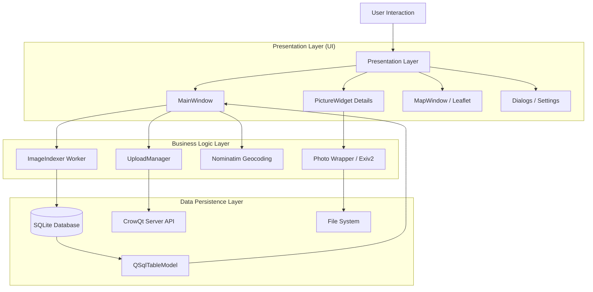

<div id="top" align="center">
<h1>Desktop-Gallery</h1>

<p>A high-performance, professional Desktop Picture Gallery and Image management tool.</p>
<p>Developed for Linux, macOS, and Windows.</p>

[Report Issue](https://github.com/Zheng-Bote/qt_desktop-gallery/issues) · [Request Feature](https://github.com/Zheng-Bote/qt_desktop-gallery/pulls)

[](https://choosealicense.com/licenses/mit/)
[](https://github.com/Zheng-Bote/qt_desktop-gallery/releases)

</div>

<hr>
<!-- START doctoc generated TOC please keep comment here to allow auto update -->
<!-- DON'T EDIT THIS SECTION, INSTEAD RE-RUN doctoc TO UPDATE -->
**Table of Contents**

- [Description](#description)
  - [Key Features](#key-features)
    - [🚀 Performance & Core](#-performance--core)
    - [🌍 Geo-Intelligence](#-geo-intelligence)
    - [📝 Metadata Management](#-metadata-management)
    - [☁️ Export & Cloud](#-export--cloud)
    - [🌐 Internationalization](#-internationalization)
  - [see also](#see-also)
- [Status](#status)
- [Getting Started](#getting-started)
  - [Prerequisites](#prerequisites)
  - [Project Structure](#project-structure)
  - [Build Instructions](#build-instructions)
- [Documentation & Screenshots](#documentation--screenshots)
- [Architecture Overview](#architecture-overview)
  - [1. Technology Stack](#1-technology-stack)
  - [2. High-Level Architecture Diagram](#2-high-level-architecture-diagram)
- [Authors and License](#authors-and-license)
    - [Code Contributors](#code-contributors)

<!-- END doctoc generated TOC please keep comment here to allow auto update -->
  <hr>

# Description

[](https://www.qt.io/)
[](https://en.cppreference.com/w/cpp/23)

**Desktop-Gallery** is a powerful Picture Gallery and Image management tool built with **C++23** and **Qt6**. It is designed to handle large photo collections efficiently using a multithreaded architecture and a local SQLite database.

Beyond viewing images, it serves as a comprehensive **Metadata Editor** and **Workflow Tool**, allowing photographers to synchronize EXIF/IPTC/XMP data, geocode images via OpenStreetMap, visualize locations on an interactive map, and bulk-export assets to WebP or upload them directly to a CrowQtServer ([Crow Web-Gallery](https://github.com/Zheng-Bote/web-gallery_webserver)) instance.

## Key Features

✅ runs on Linux
✅ runs on MacOS
✅ runs on Windows

### 🚀 Performance & Core

- **Database-Driven:** High-performance SQLite backend with caching for instant search and filtering.
- **Multithreading:** Asynchronous recursive folder scanning and thumbnail generation.
- **Cross-Platform:** Runs natively on Linux, macOS, and Windows.

### 🌍 Geo-Intelligence

- **Reverse Geocoding:** Automatically fetch address data (City, Street, Country) based on GPS coordinates using **OpenStreetMap (Nominatim)**.
- **Interactive Map View:** Visualize selected images on a map using Leaflet.js integration.
- **GPS Data Management:** Read, write, and propagate GPS metadata.

### 📝 Metadata Management

- **Comprehensive Editor:** View and edit **EXIF**, **IPTC**, and **XMP** data.
- **Smart Synchronization:** Automatically syncs metadata between standards (e.g., changing EXIF Copyright updates IPTC and XMP fields instantly).
- **Bulk Operations:** Write default metadata (Copyright, Author) to multiple selected images at once.
- **Smart Rename:** Bulk rename files based on their creation timestamp.

### ☁️ Export & Cloud

- **WebP Bulk Export:** Convert images to WebP with customizable quality, resizing, and watermarking.
- **Cloud Upload Client:** Integrated client to upload images and metadata to a CrowQtServer (supports JWT Auth & Refresh Tokens).

### 🌐 Internationalization

- i18n: Support for multiple languages (English, German).

## see also

| Product                                                                            | Description                                                              |
| ---------------------------------------------------------------------------------- | ------------------------------------------------------------------------ |
| [CrowQtServer](https://github.com/Zheng-Bote/web-gallery_webserver)                | Crow ReST API Server with Qt6 & Worker (Inbox-Pattern) for Web-Gallery   |
| [Webserver Admin](https://github.com/Zheng-Bote/web-gallery_webserver-admin)       | extending CrowQtServer API Server to SCS (web-based user management etc) |
| [Web-Gallery frontend](https://github.com/Zheng-Bote/web-gallery_gallery-frontend) | Angular Web-Frontend for Web-Gallery                                     |
| [Desktop-Gallery](https://github.com/Zheng-Bote/web-gallery_desktop-gallery)       | Desktop-Gallery image management and uploader to Web-Gallery             |
| [CrowQtClient](https://github.com/Zheng-Bote/crow_webserver_desktop-client)        | simple Desktop Client to upload Pictures to the Web-Gallery              |
| [CliImgClient](https://github.com/Zheng-Bote/qt_files_photo-gallery)               | Commandline Batch Image processing and uploader to Web-Gallery           |

<p align="right">(<a href="#top">back to top</a>)</p>

# Status


[](https://github.com/Zheng-Bote/web-gallery_desktop-gallery/releases)


# Getting Started

## Prerequisites

To build this project, you need the following dependencies installed:

- **CMake** (3.16+)
- **C++ Compiler** supporting C++23 (GCC 13+, Clang 16+, MSVC 2022)
- **Qt6** (Core, Gui, Widgets, Sql, Concurrent, Network, WebEngineWidgets, LinguistTools)
- **Exiv2** (Library for image metadata)

## Project Structure

```
.
├── CMakeLists.txt # Main build configuration
├── LICENSE # MIT License
├── README.md # Project documentation
├── configure
│   └── rz_config.hpp.in # Version and Project defines
├── i18n # Translation files (.ts and .qm)
│   ├── gallery_de.ts
│   └── gallery_en.ts
├── include # Header files (.hpp)
│   ├── DatabaseManager.hpp # SQLite encapsulation
│   ├── LoginDialog.hpp # Server Auth UI
│   ├── MapWindow.hpp # QWebEngine Map View
│   ├── MainWindow.hpp # Main GUI Logic
│   ├── UploadManager.hpp # Network/Upload Logic
│   ├── rz_metadata.hpp # Metadata Definitions & Mappings
│   └── rz_photo.hpp # Image & Exiv2 Wrapper
├── resources # Icons and Assets
│   └── img
├── src # Source files (.cpp)
│   ├── DatabaseManager.cpp
│   ├── ImageIndexer.cpp # Multithreaded Scanner
│   ├── MainWindow.cpp
│   ├── MapWindow.cpp
│   ├── ThumbnailDelegate.cpp # Custom Grid Rendering
│   ├── UploadManager.cpp
│   ├── main.cpp # Entry Point
│   ├── picture_widget.cpp # Detail View
│   └── rz_photo.cpp # Exiv2 Implementation
```

## Build Instructions

```bash
# 1. Clone the repository
git clone [https://github.com/Zheng-Bote/qt_desktop-gallery.git](https://github.com/Zheng-Bote/qt_desktop-gallery.git)
cd qt_desktop-gallery

# 2. Create build directory
mkdir build && cd build

# 3. Configure with CMake
cmake ..

# 4. Build
cmake --build .
```

<p align="right">(<a href="#top">back to top</a>)</p>

# Documentation & Screenshots

> \[!NOTE]
> please visit [Desktop-Gallery Github Pages](https://zheng-bote.github.io/web-gallery_desktop-gallery/) for more.


# Architecture Overview

**Desktop-Gallery** is a high-performance, multithreaded desktop application designed for managing, editing, and distributing digital photography. It is built using **modern C++ (C++23)** and the **Qt 6 Framework**.

The application follows a **Model-View-Controller (MVC)** architectural pattern, leveraging Qt's efficient signal/slot mechanism for event-driven communication and SQLite for persistent data storage.

## 1. Technology Stack

* **Language:** C++23
* **GUI Framework:** Qt 6.x (Widgets, GUI, Core)
* **Database:** SQLite 3 (via QtSql)
* **Concurrency:** QtConcurrent / QThreadPool
* **Networking:** QtNetwork (REST API / Multipart Uploads)
* **Web Engine:** QtWebEngine (Chromium-based) for Map rendering
* **Metadata Library:** Exiv2 (via custom `Photo` wrapper)
* **Build System:** CMake

## 2. High-Level Architecture Diagram




<p align="right">(<a href="#top">back to top</a>)</p>

# Authors and License

**License**
Distributed under the MIT License. See LICENSE for more information.

Copyright (c) 2025 ZHENG Robert

**Authors**

- [](https://www.github.com/Zheng-Bote)

### Code Contributors


[](https://www.github.com/Zheng-Bote)

<hr>

:vulcan_salute:
