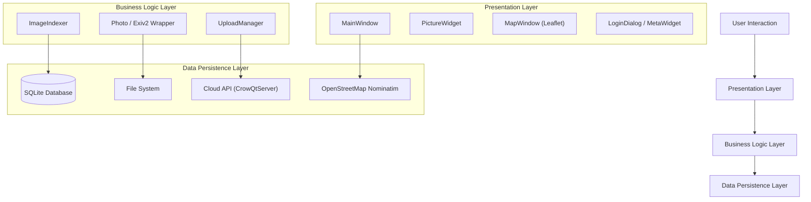

# Bounded Contexts

```mermaid
graph TD
    User["User Interaction"] --> PresentationLayer["Presentation Layer"]

    subgraph "Presentation Layer"
        MW["MainWindow"]
        PW["PictureWidget"]
        MAP["MapWindow (Leaflet)"]
        DLG["LoginDialog / MetaWidget"]
    end

    PresentationLayer --> BusinessLogic["Business Logic Layer"]

    subgraph "Business Logic Layer"
        IDX["ImageIndexer"]
        UP["UploadManager"]
        PHOTO["Photo / Exiv2 Wrapper"]
    end

    BusinessLogic --> DataPersistence["Data Persistence Layer"]

    subgraph "Data Persistence Layer"
        DB[("SQLite Database")]
        FS["File System"]
        API["Cloud API (CrowQtServer)"]
        GEO["OpenStreetMap Nominatim"]
    end

    IDX --> DB
    PHOTO --> FS
    UP --> API
    MW --> GEO
```
