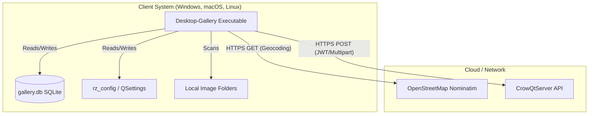

# Deployment Diagram

```mermaid
graph TD
    subgraph "Client System (Windows, macOS, Linux)"
        App[Desktop-Gallery Executable]
        DB[(gallery.db SQLite)]
        Config[rz_config / QSettings]
        LocalFiles[Local Image Folders]

        App -->|Reads/Writes| DB
        App -->|Reads/Writes| Config
        App -->|Scans| LocalFiles
    end

    subgraph "Cloud / Network"
        OSM[OpenStreetMap Nominatim]
        WebGallery[CrowQtServer API]
    end

    App -- "HTTPS GET (Geocoding)" --> OSM
    App -- "HTTPS POST (JWT/Multipart)" --> WebGallery
```
