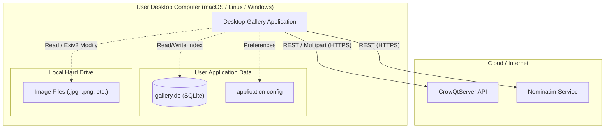

# Deployment View

```mermaid
flowchart TD
    subgraph Client ["User Desktop Computer (macOS / Linux / Windows)"]
        App["Desktop-Gallery Application"]
        
        subgraph AppData ["User Application Data"]
            DB[("gallery.db (SQLite)")]
            Config["application config"]
        end
        
        subgraph HardDrive ["Local Hard Drive"]
            Images["Image Files (.jpg, .png, etc.)"]
        end
        
        App -.->|Read/Write Index| DB
        App -.->|Preferences| Config
        App -.->|Read / Exiv2 Modify| Images
    end
    
    subgraph Cloud ["Cloud / Internet"]
        Server["CrowQtServer API"]
        OSM["Nominatim Service"]
    end
    
    App -- "REST / Multipart (HTTPS)" --> Server
    App -- "REST (HTTPS)" --> OSM
```
