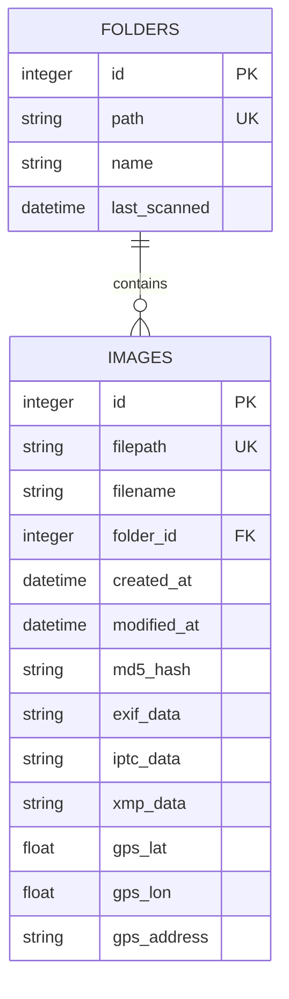

# Entity Relationship Diagram (SQLite)

```mermaid
erDiagram
    IMAGES {
        integer id PK
        string filepath UK
        string filename
        integer folder_id FK
        datetime created_at
        datetime modified_at
        string md5_hash
        string exif_data
        string iptc_data
        string xmp_data
        float gps_lat
        float gps_lon
        string gps_address
    }
    
    FOLDERS {
        integer id PK
        string path UK
        string name
        datetime last_scanned
    }
    
    FOLDERS ||--o{ IMAGES : "contains"
```
