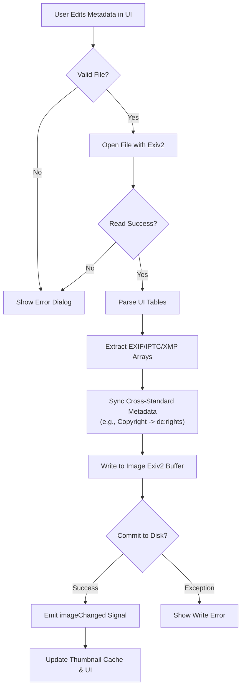

<!-- START doctoc generated TOC please keep comment here to allow auto update -->
<!-- DON'T EDIT THIS SECTION, INSTEAD RE-RUN doctoc TO UPDATE -->
**Table of Contents**

- [Flowchart: Metadata Writing](#flowchart-metadata-writing)

<!-- END doctoc generated TOC please keep comment here to allow auto update -->

# Flowchart: Metadata Writing

