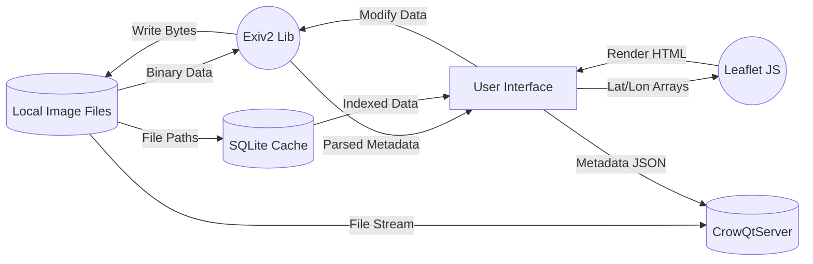

# Information Flow Diagram

```mermaid
flowchart LR
    Source[(Local Image Files)]
    DB[(SQLite Cache)]
    Exiv2((Exiv2 Lib))
    UI[User Interface]
    Map((Leaflet JS))
    Cloud[(CrowQtServer)]

    Source -->|Binary Data| Exiv2
    Exiv2 -->|Parsed Metadata| UI
    UI -->|Modify Data| Exiv2
    Exiv2 -->|Write Bytes| Source

    Source -->|File Paths| DB
    DB -->|Indexed Data| UI

    UI -->|Lat/Lon Arrays| Map
    Map -->|Render HTML| UI

    Source -->|File Stream| Cloud
    UI -->|Metadata JSON| Cloud
```
