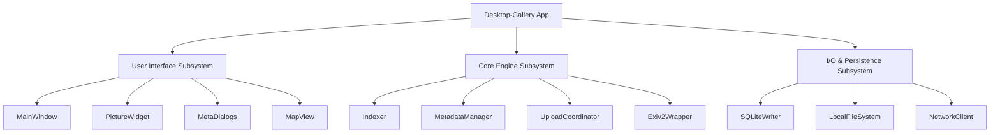

# Logical Decomposition Diagram

```mermaid
graph TD
    System[Desktop-Gallery App]

    System --> UI[User Interface Subsystem]
    System --> Core[Core Engine Subsystem]
    System --> IO[I/O & Persistence Subsystem]

    UI --> MainWindow
    UI --> PictureWidget
    UI --> MetaDialogs
    UI --> MapView

    Core --> Indexer
    Core --> MetadataManager
    Core --> UploadCoordinator
    Core --> Exiv2Wrapper

    IO --> SQLiteWriter
    IO --> LocalFileSystem
    IO --> NetworkClient
```
