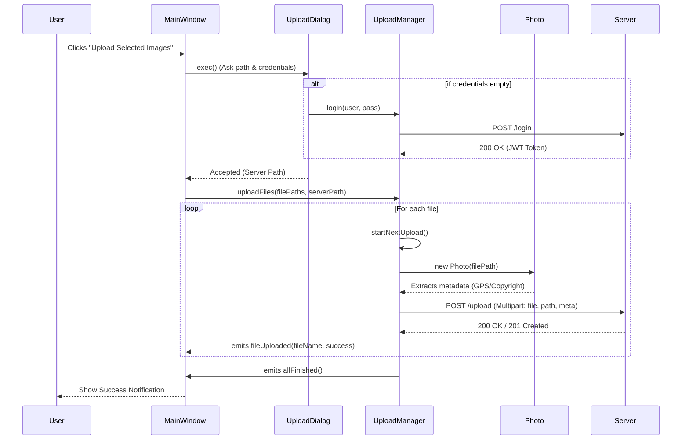

# Sequence Diagram: Image Upload Process

```mermaid
sequenceDiagram
    participant User
    participant MainWindow
    participant UploadDialog
    participant UploadManager
    participant Photo
    participant Server

    User->>MainWindow: Clicks "Upload Selected Images"
    MainWindow->>UploadDialog: exec() (Ask path & credentials)

    alt if credentials empty
        UploadDialog->>UploadManager: login(user, pass)
        UploadManager->>Server: POST /login
        Server-->>UploadManager: 200 OK (JWT Token)
    end

    UploadDialog-->>MainWindow: Accepted (Server Path)
    MainWindow->>UploadManager: uploadFiles(filePaths, serverPath)
    
    loop For each file
        UploadManager->>UploadManager: startNextUpload()
        UploadManager->>Photo: new Photo(filePath)
        Photo-->>UploadManager: Extracts metadata (GPS/Copyright)
        UploadManager->>Server: POST /upload (Multipart: file, path, meta)
        Server-->>UploadManager: 200 OK / 201 Created
        UploadManager->>MainWindow: emits fileUploaded(fileName, success)
    end

    UploadManager->>MainWindow: emits allFinished()
    MainWindow-->>User: Show Success Notification
```
