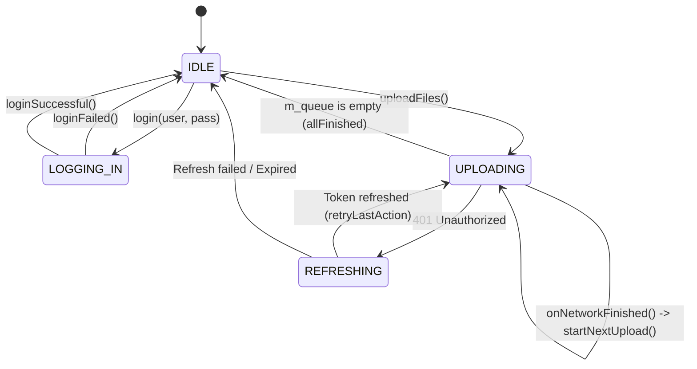

# State Diagram: UploadManager

```mermaid
stateDiagram-v2
    [*] --> IDLE
    
    IDLE --> LOGGING_IN : login(user, pass)
    LOGGING_IN --> IDLE : loginFailed()
    LOGGING_IN --> IDLE : loginSuccessful()
    
    IDLE --> UPLOADING : uploadFiles()
    
    UPLOADING --> UPLOADING : onNetworkFinished() -> startNextUpload()
    UPLOADING --> REFRESHING : 401 Unauthorized
    
    REFRESHING --> UPLOADING : Token refreshed (retryLastAction)
    REFRESHING --> IDLE : Refresh failed / Expired
    
    UPLOADING --> IDLE : m_queue is empty (allFinished)
```
