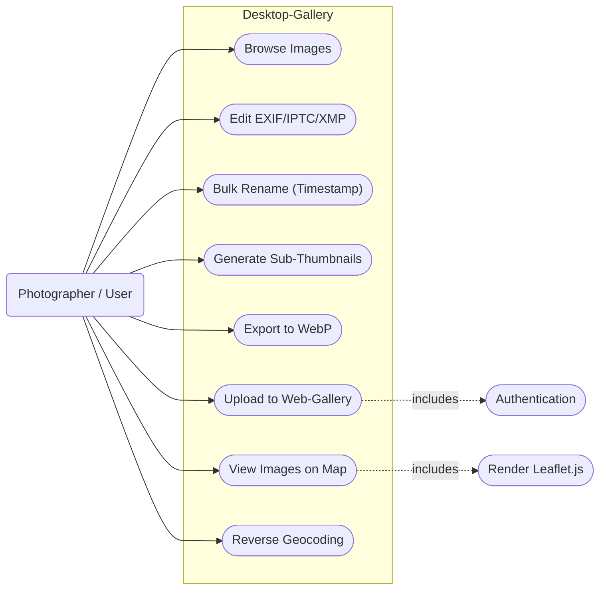

# Use Case Diagram

```mermaid
flowchart LR
    User("Photographer / User")
    
    subgraph App ["Desktop-Gallery"]
        UC1(["Browse Images"])
        UC2(["Edit EXIF/IPTC/XMP"])
        UC3(["Bulk Rename (Timestamp)"])
        UC4(["Generate Sub-Thumbnails"])
        UC5(["Export to WebP"])
        UC6(["Upload to Web-Gallery"])
        UC7(["View Images on Map"])
        UC8(["Reverse Geocoding"])
    end

    User --> UC1
    User --> UC2
    User --> UC3
    User --> UC4
    User --> UC5
    User --> UC6
    User --> UC7
    User --> UC8

    UC6 -.->|includes| Auth(["Authentication"])
    UC7 -.->|includes| Leaflet(["Render Leaflet.js"])
```
